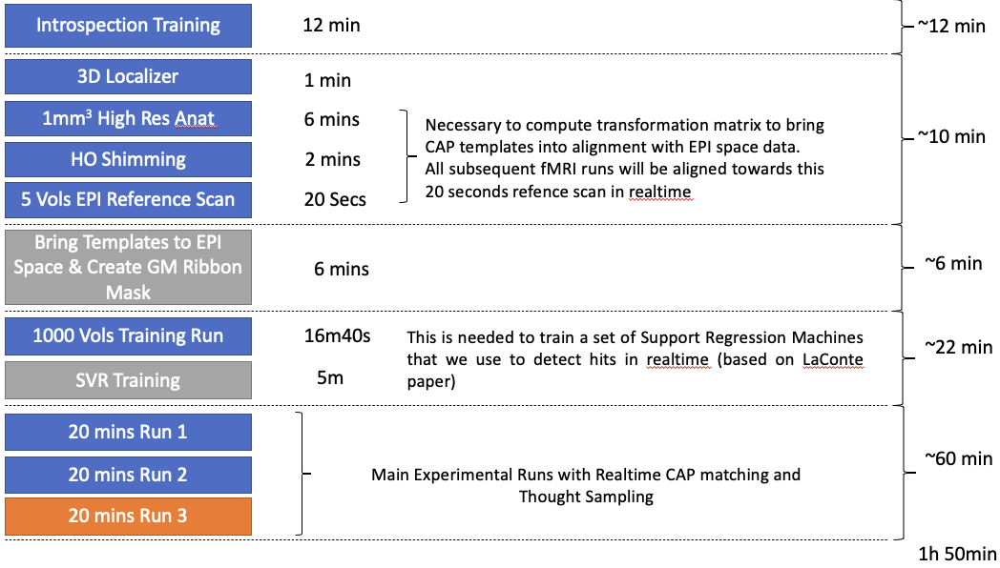
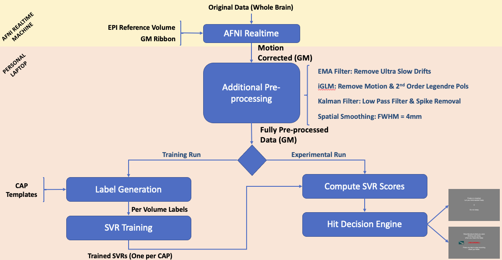
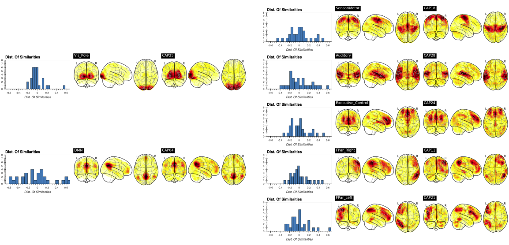
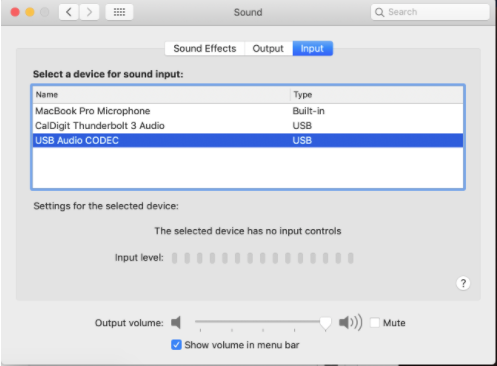
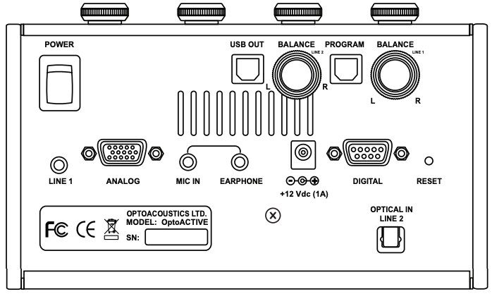

A typical scanning session
==========================

Note: this is currently out of date

|image1|

Before subjects enter the scanner, the experimenter would provide
subjects with instructions about the experiment and run a few samples of
how things will work inside the scanner (Introspection Training).

Next, subjects will be places in the scanner bore and:

- Pulse Oximeter will be placed on the left index finger
- Respiratory Belt will be placed on the abdomen
- Response Box/Joistick will be provided in the right hand
- Optoacoustic headphones will be put in place (over ear protection)
- Optoacoustic microphone will be place near the mouth
- Place mirror so subjects can read the projection screen.

Future options:

- Eye tracker
- MRI-Compatible High Resolution Camera (to record body motion and/or
  facial expressions)
- MRI-Compatible EEG

During each scanning session, the following scans will take place:

a. 3D Localizer
b. High Resolution T1
c. High Order Shimming (required EPI prescription)
d. Short 5vols EPI Reference scan (maybe blip up/blip down)

At this point, the experimenter should run the first pre-processing
script (01_BringROIsToSubjectSpace.sh):

.. code:: bash

   cd EXXXX
   sh ./01_BringROIsToSubjectSpace.sh EPIREFFILE ANATREF CAPS_FILE

INPUTS:

- EPIREFILE will be the scan created by the AFNI realtime in step (d)
- ANATREF will be the scan created by the AFNI realtime in step (b)
- CAPS_FILE will be the local copy of Frontiers2013_CAPs.nii in the
  local directory (and previously copied as described in Section X
  below)
- 

OUTPUTS:

- GMribbon_R4Feed.nii: This is the mask that will be used for sending
  data in the AFNI realtime plugin. This GM ribbon is adapted from
  MNI_Glasser_HCP_v1.0.nii.gz.

- Frontiers2013_CAPs_R4Feed.nii: This are the templates aligned to the
  EPI space of this subject and on the same spatial resolution.

- EPIREF+orig: This file provides the reference space for the rest of
  the experiment. It will be provided as the “Ext. Dset” in the AFNI
  realtime plugin (see below).

- Spatial Tranformation matrices: Need to run to see what exactly it
  produces.

..

   NOTE: GMribbon_R4Feed.nii and Frontiers2013_CAPs_R4Feed.nii will need
   to be transfered to the experimental laptop, as this mask is used on
   the other end of the communication to reconstruct the actual location
   of each datapoint. Instructions on how to perform this transfer are
   provided when the script finishes.

--------------

Overview of what the Software does
==================================

|image2| \**\*

Targeted CAPs
=============

In July 2019, Xiao Liu (former post-doctoral fellow at Jeff Dyun group)
was kind to share with me the CAPs template assocuated with his
Frontiers 2013 paper. We provided me with the template for the 30 CAPs
that were originally described on his work. Many of these CAPs are
highly similar, so for our initial evaluation we decided to only use a
subset of the CAPs (see figure below)

|image3|

--------------

Experimental Hardware Setup
===========================

Three different computers are involved in this experimental setup:

- Scanner Console
- Realtime System (AFNI)
- Experimental Laptop

All computers need to be in the intranet of the scanner (see
instructions below)

In addition to the computers, other important pieces of hardware
include:

- Audio Delivery System: we will use the noise cancellation headphones
  (OptoAcoustics)
- Audio Recording System: we will use the noise cancellation microphone
  (OptoAcoustics)
- Video Delivery System: we will use the screen at the back of the
  scanner + mirror.

Before we can run the experiment, several configuration steps are
required:

1. AUDIO DELIVERY SETUP
~~~~~~~~~~~~~~~~~~~~~~~

- To pass audio from the laptop to the OptoAcostics system use a
  headphones-like cable that goes from the laptop headphones connection
  to line 1 in the back of the optoacoustic box

- Ensure Line 1 volume (in OptoAcoustic box) is to the maximum

- In the laptop ensure Sound Output is set to External Headphones

  |image4|

2. AUDIO RECORDING SYSTEM
~~~~~~~~~~~~~~~~~~~~~~~~~

- In the OptoAcoustics Box, ensure the following options/buttons are set
  correctly:

  - FOMRI Noise Canceller Button ON (Green)
  - MONITOR FORMI ON (Green)
  - Connect USB-A port from OptoAcoustics (USB OUT in back) to any USB-C
    port in the laptop using the small adaptors (Q)

  |image5|

  - Self Hearing Knob in the middle
  - Speaker Knob in the middle

- In the laptop set Audio Input to USB Audio CODEC: |image6|

..

   NOTE: Don’t make any of the audio go through the CalDigital DOCK as
   it creates some sort of loop with the input and output of sound.

3. SCREEN / PROJECTION SETUP
~~~~~~~~~~~~~~~~~~~~~~~~~~~~

- On the DL Matrix, ensure DVI is the input to LCD1, LCD2 and MRILCD
- Switch on the MRILCD and LCD2 screens
- Connect the MINI DP to the Computer directly using the StarTech.com
  adapter
- Ensure the LCD/BOLD Screens are the primary monitors (for Full Screen
  to work)

..

   NOTE: Do not connect the monitor through the dock as it causes issues
   with intermittent disconnection.

--------------

Experimental Software Setup
===========================

1. Setup the correct AFNI Realtime Plugin
~~~~~~~~~~~~~~~~~~~~~~~~~~~~~~~~~~~~~~~~~

2. Copy processing scripts to EXXXX directory
~~~~~~~~~~~~~~~~~~~~~~~~~~~~~~~~~~~~~~~~~~~~~

1. Copy 01_BringROIsToSubjectSpace.sh from
   PRJ_Dir/Scripts/Realtime_Scanner/01_BringROIsToSubjectSpace.sh to the
   EXXXX directory in the realtime system.

..

   NOTE: This directory only exists after AFNI has started, meaning, you
   need to wait until the completion of the 3d Localizer to perform this
   operation.

   NOTE: It may be necessary to change some of the paths

3. Copy the Templates to the EXXX directory.
~~~~~~~~~~~~~~~~~~~~~~~~~~~~~~~~~~~~~~~~~~~~

- CAP Templte: This template (Frontiers2013_CAPs.nii) is available in
  the Others folder in this project and needs to be copied into the
  EXXXXX dir.

- GM Ribbon Template: This template (MNI_Glasser_HCP_v1.0.nii.gz) is
  available in the Others folder in this project and needs to be copied
  into /home/sdc/javiergc/CAPs_Frontiers2013/jan15/ in the realtime
  system.

..

   NOTE: If we change 01_BringROIsToSubjectSpace.sh, we could also copy
   this file to the local EXXXX dir. One plus of this way of doing
   things is that anyting in the EXXXX gets saved into gold by the
   realtime system and can be found later.

.. |image6| image:: _static/images/audio_output_config.png
