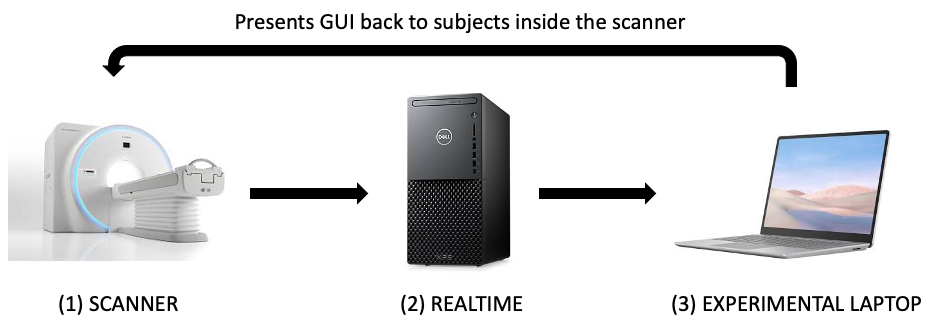
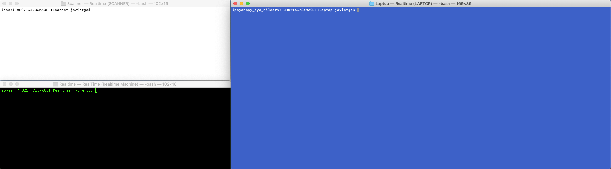
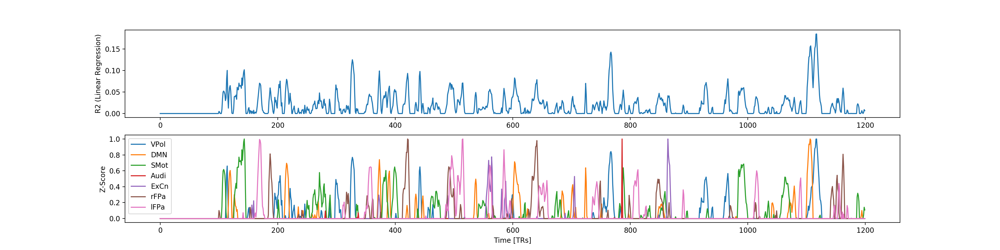

Simulate an experiment
======================

This section describes how to simulate experiments without access to the
scanner. This is very useful during software development and testing, as
all functionalities can be tested without having to request scanner time.

During an experiment, there are three different computers involved. Data
flows in the following manner.

First, the scanner (1) acquires images and sends them to the realtime system
(2).

For each incoming EPI image, the realtime system performs the following
operations:

- alignment towards reference volume
- estimation of head motion
- extraction of data within a mask.

Both motion parameters and extracted voxel-wise values within the
mask are subsequently sent via TCP/IP to the experimental laptop (3).

The experimental laptop takes incoming data, does additional
pre-processing, and then drives the experiment GUI based on how that
incoming data looks like a series of pre-defined templates.

When developing this software, we will need to simulate the workings of
these three systems, but using a single machine (our development
machine). The rest of this section describes how to accomplish this
process.

1. Open three different Terminals on your laptop in the ``Simulation/``
directory, then ``cd`` to the following directories:

- **Scanner**: you will use this window to simulate the scanner sending
  data to AFNI realtime
- **Realtime**: here you will start AFNI in realtime mode. It will take
  incoming data from the “fake” scanner, and after a few things sending
  on its way to the rtcog software.
- **Laptop**: here you will start the rtcog software.

2. Download the sample data

- Enter the empty **Scanner** folder.
- Download sample datasets to the **Scanner** folder.

To a minimum you should have an anatomical dataset, a short EPI dataset
to use as reference for alignment, and then two additional long EPI
datasets: one will be used for training the classifier and the second
one to simulate a real experience sampling run.

3. Go to the **Realtime** teminal:

- Enter the empty **Realtime** folder.
- Copy the 01_BringROIsToSubjectSpace.sh script here.
- Copy the Frontiers2013_CAPs.nii file here.
- Export the following variables

.. code:: bash

   export AFNI_REALTIME_Registration=3D:_realtime
   export AFNI_REALTIME_Base_Image=2
   export AFNI_REALTIME_Graph=Realtime
   export AFNI_REALTIME_MP_HOST_PORT=localhost:53214
   export AFNI_REALTIME_SEND_VER=YES
   export AFNI_REALTIME_SHOW_TIMES=YES
   export AFNI_REALTIME_Mask_Vals=ROI_means
   export AFNI_REALTIME_Function=FIM

- Start AFNI in realtime mode

``$ afni -rt``

4. Simulate acquisition of anatomical dataset

On the **Scanner** console, type:

.. code:: bash

   rtfeedme Anat+orig

By the end of this step, you should have a new dataset (rt.\__001+orig)
that contains the anatomical data (but now in the realtime system) in
the **Realtime** folder.

5. Simulate acquisition of the EPI reference dataset

On the **Scanner** console, type:

.. code:: bash

   rtfeedme EPI_Reference+orig

By the end of this step, you should have a second dataset on **Realime**
(rt.\__002+orig) on the **Realtime** folder that contains the EPI
reference data (but now in the realtime system)

6. Pre-process Anatomical and bring masks to EPI Reference space

- Go to the **Realtime** terminal
- Run ``01_BringROIsToSubjectSpace.sh`` as follows:

.. code:: bash

   sh ./01_BringROIsToSubjectSpace.sh \
          rt.__002+orig. \
          rt.__001+orig. \
          Frontier2013_CAPs.nii

This will generate a lot of new files. The key ones moving forward are:

- ``EPIREF+orig``: this will become our reference volume for realtime
  alignemnt.
- ``GMribbon_R4Feed.nii``: this will be our mask for sending data to the
  laptop.
- ``Frontiers2013_R4Feed.nii``: this will be our CAPs template aligned
  to the EPI data.

The last two files need to be transfered (i.e., copied) to the
**Laptop** directory.

.. code:: bash

   $cp ${REALTIME_FOLDER}/GMribbon_R4Feed.nii ${LAPTOP_FOLDER}
   $cp ${REALTIME_FOLDER}/Frontiers2013_R4Feed.nii ${LAPTOP_FOLDER}

7. Configure the realtime plugin for the rest of the experiment.

In the main AFNI window, click on Define Datamode –> Plugins –> RT
Options

On the new window, ensure the following configurations:

- Registration = 3D: realtime
- Resampling = Quintic
- Reg Base = External Dataset
- External Dset = EPIREF+orig
- Base Image = 0
- NR = 1200 (Or as many volumes as you are expecting in the next run)
- Mask = GMribbon_R4Feed.nii
- Val to Send = All Data (light)

8. Start ``rtcog`` in Basic in the **Laptop** terminal.

See :doc:`/usage` for instructions.

9. Simulate acquisition of the training run

In the **Scanner** console, type:

.. code:: bash

   rtfeedme TrainingRun+orig

The data will be send to AFNI, who in turn will do motion correction
(towards the EPI reference dataset), and then send the values of each
voxel in the GMribbon mask to the rtcog program that is listening by
default on port 53214. By the end of this step, in the **Laptop** folder
you should have the following files:

- ``$prefix_Options.yaml``: record of all the options.
- ``$prefix.Motion.1D``: motion estimates.
- ``$prefix.Zscore.nii``: final per-TR activity map?
- ``$prefix.pp_EMA.nii``: data following the EMA step.
- ``$prefix.pp_iGLM.nii``: data following the incremental GLM step.
- ``$prefix.pp_iGLM_$regressor.nii``: fitting (beta value) of each
  nuisance regressor.
- ``$prefix.pp_LPfilter.nii``: data following the low pass filtering
  step.
- ``$prefix.pp_Smotth.nii``: data following the spatial smoothing step.

10. Train the SVR

Select the templates of interest and create txt file with labels:

.. code:: bash

   3dTcat -prefix Templates_R4Feed.nii Frontier2013_CAPs_R4Feed.nii"[25, 4, 18, 28, 24, 11, 21]"
   echo "VPol,DMN,SMot,Audi,ExCn,rFPa,lFPa" >> template_labels.txt

Go to the **Laptop** terminal and run:

.. code:: bash

    python ../../rtcog/bin/online_trainSVRs.py \
           -d ./training.pp_Zscore.nii \
           -m ./GMribbon_R4Feed.nii \
           -t ./Templates_R4Feed.nii \
           -l ./template_labels.txt \
           -o ./ \
           -p training_svr \
           --no_lasso

This will generate the following additional files in the **Laptop**
folder:

- ``training_svr.pkl``: trained SVRs (needed for the rest of the
  experimental runs)
- ``training_svr_training_vols.csv``: ?
- ``training_svr_lm_R2.csv``: R2 for linear regerssion on training data
- ``training_svr_lm_z_labels.csv``: TR-by-TR labels of SVRs (after
  Z-scoring)
- ``training_svr.png``: static summary of SVR traning
- ``training_svr.html``: dynamic summary of SVR traning

Here is an example of the static training report

Instead of training SVRs, you can also use the mask method for spatial
matching. The program expects a binarized templates. If you pass in
``--template_type normal``, the program will do the thresholding for
you. You can adjust the threshold with ``--thr``.

.. code:: bash

   python ../../rtcog/bin/mask.py \
           --data online_preproc.pp_Zscore.nii \
           --mask GMribbon_R4Feed.nii \
           --templates_path ROI_Data.nii \
           --template_labels_path ROI_Defs.txt \
           --out_dir ./ \
           --prefix mask_method

This will generate the following additional files in the **Laptop**
folder:

- ``mask_method.template_data.npz``: template data (needed for the rest
  of the experimental runs, to be passed in with ``--match_path``
  argument)
- ``mask_method.act_traces.npz``: The activity traces from this method
- ``mask_method.traces.png``: static summary of the activity traces
- ``mask_method.traces.html``: dynamic summary of the activity traces

Using the output of this method, decide on a threshold to use in the
experimental run (``--hit_thr``)

11. Start rtcog to deal with a real Experience Sampling Run

Now that you have trained the SVR (or created the mask method templates),
you can simulate a real experience sampling run. First set ``match_method``
in the config yaml to either ``svr`` or ``mask_method`` depending on which
approach you want to use.  Then, start the experiment. Refer to :doc:`/usage`
for instructions.

NOTE: This doc is a work in process