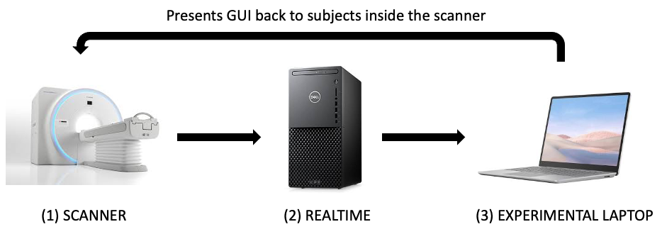
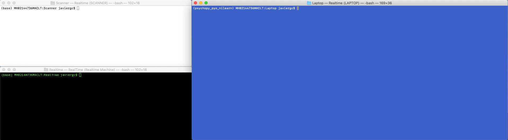
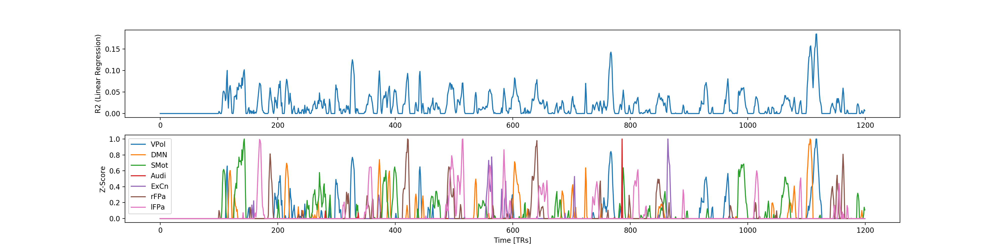

Simulate an experiment
======================

.. important::

   The repository tracks empty ``Simulation/Scanner``, ``Simulation/Realtime``,
   and ``Simulation/Laptop`` directories, but it does not distribute the sample
   imaging datasets, ``01_BringROIsToSubjectSpace.sh``, or the original CAP
   template. Obtain protocol-compatible copies from the study team before using
   this workflow. There is currently no public download location recorded in
   the repository.

This section describes how to simulate experiments without access to the
scanner. This is very useful during software development and testing, as
all functionalities can be tested without having to request scanner time.

During an experiment, there are three different computers involved. Data
flows in the following manner.

First, the scanner (1) acquires images and sends them to the realtime system
(2).

For each incoming EPI image, the realtime system performs the following
operations:

- alignment towards reference volume
- estimation of head motion
- extraction of data within a mask.

Both motion parameters and extracted voxel-wise values within the
mask are subsequently sent via TCP/IP to the experimental laptop (3).

The experimental laptop takes incoming data, does additional
pre-processing, and then drives the experiment GUI based on how that
incoming data looks like a series of pre-defined templates.

When developing this software, we will need to simulate the workings of
these three systems, but using a single machine (our development
machine). The rest of this section describes how to accomplish this
process.

1. Open three different Terminals on your laptop in the ``Simulation/``
directory, then ``cd`` to the following directories:

- **Scanner**: you will use this window to simulate the scanner sending
  data to AFNI realtime
- **Realtime**: here you will start AFNI in real-time mode. It will process
  incoming data from the simulated scanner and forward it to rtcog.
- **Laptop**: here you will start the rtcog software.

2. Stage the external sample data

- Enter the empty **Scanner** folder.
- Copy the protocol's sample datasets to the **Scanner** folder.

At minimum you should have an anatomical dataset, a short EPI dataset
to use as reference for alignment, and then two additional long EPI
datasets: one will be used for training the classifier and the second
one to simulate a real experience sampling run.

3. Go to the **Realtime** terminal:

- Enter the empty **Realtime** folder.
- Copy the 01_BringROIsToSubjectSpace.sh script here.
- Copy the Frontiers2013_CAPs.nii file here.
- Export the following variables

.. code:: bash

   export AFNI_REALTIME_Registration=3D:_realtime
   export AFNI_REALTIME_Base_Image=2
   export AFNI_REALTIME_Graph=Realtime
   export AFNI_REALTIME_MP_HOST_PORT=localhost:53214
   export AFNI_REALTIME_SEND_VER=YES
   export AFNI_REALTIME_SHOW_TIMES=YES
   export AFNI_REALTIME_Mask_Vals=ROI_means
   export AFNI_REALTIME_Function=FIM

These variables belong to the historical reference-dataset preparation stage.
Before connecting ``rtcog`` for the functional run, apply the current
``All_Data_light`` connection settings from :doc:`startup_afni` and the plugin
settings in step 7.

- Start AFNI in real-time mode:

.. code:: bash

   afni -rt

4. Simulate acquisition of anatomical dataset

On the **Scanner** console, type:

.. code:: bash

   rtfeedme Anat+orig

By the end of this step, you should have a new dataset (rt.\__001+orig)
that contains the anatomical data (but now in the realtime system) in
the **Realtime** folder.

5. Simulate acquisition of the EPI reference dataset

On the **Scanner** console, type:

.. code:: bash

   rtfeedme EPI_Reference+orig

By the end of this step, you should have a second dataset on **Realtime**
(rt.\__002+orig) on the **Realtime** folder that contains the EPI
reference data (but now in the realtime system)

6. Pre-process Anatomical and bring masks to EPI Reference space

- Go to the **Realtime** terminal
- Run ``01_BringROIsToSubjectSpace.sh`` as follows:

.. code:: bash

   sh ./01_BringROIsToSubjectSpace.sh \
          rt.__002+orig. \
          rt.__001+orig. \
          Frontiers2013_CAPs.nii

This will generate a lot of new files. The key ones moving forward are:

- ``EPIREF+orig``: this will become our reference volume for real-time
  alignment.
- ``GMribbon_R4Feed.nii``: this will be our mask for sending data to the
  laptop.
- ``Frontiers2013_R4Feed.nii``: this will be our CAPs template aligned
  to the EPI data.

The last two files need to be transferred (i.e., copied) to the
**Laptop** directory.

.. code:: bash

   cp GMribbon_R4Feed.nii ../Laptop/
   cp Frontiers2013_R4Feed.nii ../Laptop/

7. Configure the realtime plugin for the rest of the experiment.

In the main AFNI window, click on Define Datamode –> Plugins –> RT
Options

On the new window, ensure the following configurations:

- Registration = 3D: realtime
- Resampling = Quintic
- Reg Base = External Dataset
- External Dset = EPIREF+orig
- Base Image = 0
- NR = 1200 (Or as many volumes as you are expecting in the next run)
- Mask = GMribbon_R4Feed.nii
- Val to Send = All Data (light)

8. Start ``rtcog`` in Basic mode in the **Laptop** terminal.

See :doc:`/usage` for instructions.

9. Simulate acquisition of the training run

In the **Scanner** console, type:

.. code:: bash

   rtfeedme TrainingRun+orig

The data will be sent to AFNI, which will perform motion correction
(toward the EPI reference dataset) and send the value of each voxel in the
GMribbon mask to rtcog, which listens on port 53214 by default. By the end of
this step, the configured output directory
should contain the standard Basic outputs from :ref:`output-files`, including:

- ``<prefix>_Options.yaml``: record of all the options.
- ``<prefix>.Motion.1D``: motion estimates.
- ``<prefix>.pp_Final.nii``: final preprocessed time series.
- Per-step NIfTI files only for steps configured with ``save: true``.

10. Prepare the matcher

Select templates of interest and create a comma-separated label file in the
same order as the template volumes. For example:

.. code:: bash

   3dTcat -prefix Templates_R4Feed.nii Frontier2013_CAPs_R4Feed.nii"[25, 4, 18, 28, 24, 11, 21]"
   echo "VPol,DMN,SMot,Audi,ExCn,rFPa,lFPa" > template_labels.txt

Follow :doc:`matching` to prepare and evaluate the input for ``svr`` or
``mask``. That page contains current commands, exact output names, and the
correct ``match_method`` values.

Here is an example of the static SVR training report:

11. Run rtcog in ESAM mode

After preparing the selected matcher, simulate an experience-sampling run. Set
``match_method`` to ``svr`` or ``mask`` and set ``match_path`` to the
corresponding output described in :doc:`matching`.

Then, start the experiment. Refer to :doc:`/usage` for instructions.
For example, ``match_path`` is:

- ``training_svr.pkl`` for SVR method
- ``mask_method.template_data.npz`` for mask method
