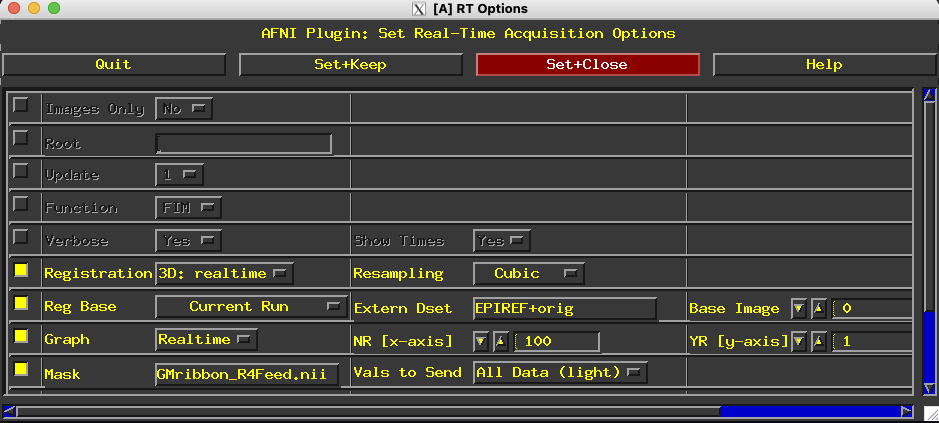

Start up AFNI in realtime mode
==============================

Export the following variables:

.. code:: bash

    export AFNI_REALTIME_Registration=3D:_realtime
    export AFNI_REALTIME_MP_HOST_PORT=localhost:53214
    export AFNI_REALTIME_SEND_VER=YES
    export AFNI_REALTIME_SHOW_TIMES=YES
    export AFNI_REALTIME_Function=FIM
    export AFNI_REALTIME_Graph=Realtime
    export AFNI_REALTIME_Base_Image=0
    export AFNI_REALTIME_Mask_Vals=All_Data_light

Start AFNI in realtime mode:

``afni -rt``

Go to Plugins > RT Options

Set ``Reg Base`` to your EPI reference dataset (e.g., ``EPIREF+orig``).

Set ``Mask`` to your mask dataset (e.g., ``GMribbon_R4Feed.nii``).

Set ``NR [x-axis]`` to the expected number of volumes in your run.

See below for how your setup should look:

TODO: have detailed instructions for when down at the scanner
