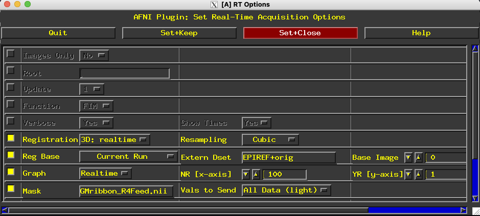

Start AFNI in real-time mode
============================

``rtcog`` listens for the motion parameters and masked voxel values sent by
AFNI's real-time plugin. Complete the checks below before beginning an
acquisition.

Connection environment
----------------------

Export the AFNI real-time settings before starting AFNI:

.. code:: bash

   export AFNI_REALTIME_Registration=3D:_realtime
   export AFNI_REALTIME_MP_HOST_PORT=localhost:53214
   export AFNI_REALTIME_SEND_VER=YES
   export AFNI_REALTIME_SHOW_TIMES=YES
   export AFNI_REALTIME_Function=FIM
   export AFNI_REALTIME_Graph=Realtime
   export AFNI_REALTIME_Base_Image=0
   export AFNI_REALTIME_Mask_Vals=All_Data_light

Use ``localhost`` only when AFNI and ``rtcog`` run on the same computer.
Otherwise, replace it with the hostname or IP address of the computer running
``rtcog``. Replace ``53214`` when the YAML ``tcp_port`` or ``--tcp_port`` value
is different.

Configure the plugin
--------------------

Start AFNI in real-time mode:

.. code:: bash

   afni -rt

In the AFNI window, open **Define Datamode > Plugins > RT Options** and set:

``Registration``
   ``3D: realtime``.

``Reg Base`` and ``Extern Dset``
   Select ``External Dataset`` and the run's EPI reference dataset, for example
   ``EPIREF+orig``.

``Mask``
   Select the mask corresponding to the ``rtcog`` ``mask_path``, for example
   ``GMribbon_R4Feed.nii``.

``Val to Send``
   ``All Data (light)``. ``rtcog`` expects one value for every nonzero mask
   voxel, not ROI means.

``NR [x-axis]``
   Expected number of run volumes; keep it consistent with ``nvols``.

Start the run
-------------

1. Start ``rtcog`` or ``rtcog_min`` with the prepared run configuration.
2. Wait for the log message indicating that the incoming connection is ready.
3. Begin scanner acquisition, or start ``rtfeedme`` during a simulation.
4. Confirm that the log reports sequential time points and does not report a
   mask-size discrepancy.

The receiver exits after the configured number of volumes. Sending additional
volumes raises a volume-overflow error, so correct ``nvols`` before restarting
the run.

Site-specific setup
-------------------

Reference-volume preparation, anatomical registration, scanner-console steps,
and transferring files between scanner systems are site- and protocol-specific.
The legacy notes in :doc:`scan_session` describe one historical setup but are
not a maintained general operating procedure.
